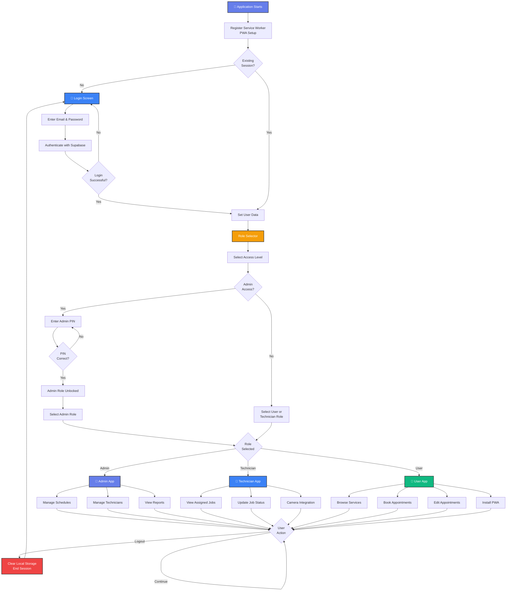

# Multi-Role PWA System Flowchart

## How to Use This Flowchart

1. **View in VS Code**: Open this file in VS Code with the Markdown Preview extension
2. **Online viewers**: Copy the diagram code and paste it at:
   - https://mermaid.live/
   - https://www.mermaidchart.com/
3. **Export as image**: Use Mermaid Live to export as PNG or SVG
